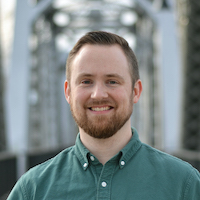
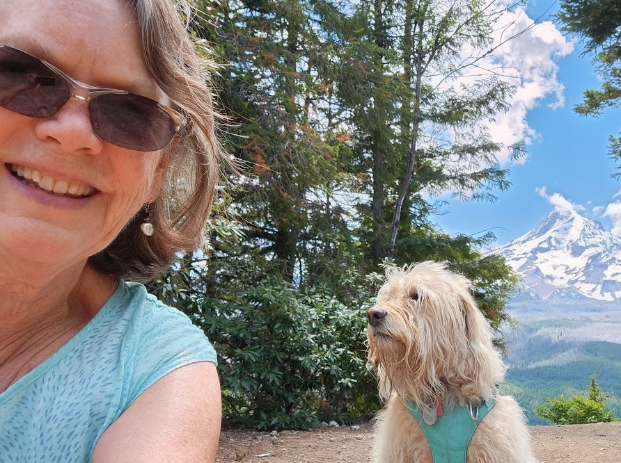
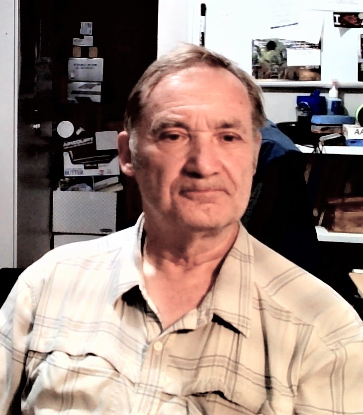
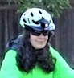
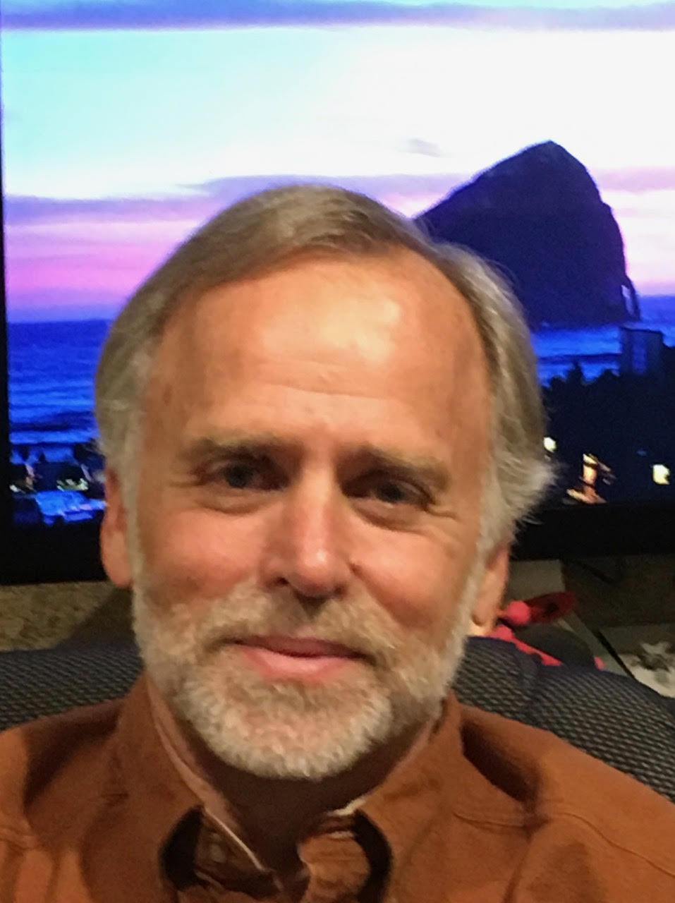
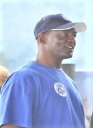
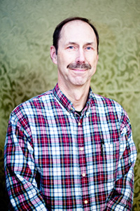
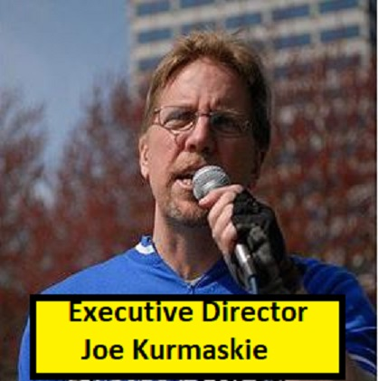
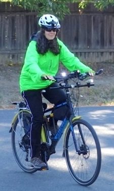

## 2024 WashCo Bikes Vision Statement

* *We see a future where bicycling is seen as a safe and practical choice for most short distance trips as well as many medium or long distance trips.*
* *We see a future where Washington County residents, businesses, and local governments prioritize and support bicycling through safe and practical infrastructure and bicycle-friendly regulations.*
* *We see a future where bicycling and bike safety are taught in schools and educational institutions, and where similar education is widely available to adults, and in multiple languages.*
* *We see a future where people using all modes of transportation are attentive, well educated, and respectful of one another.*
* *We see a future where bikes, training, and infrastructure are available to people of all ages and abilities in neighborhoods both old and new, with special emphasis on underserved communities and people.*

## Board of Directors

**Nick Baker-**

**Board of Directors Chair**

Nick is a believer in the beneficent power of active transportation and aims to make Washington County a place where all community members — regardless of their age, ability level, or background — can comfortably and conveniently travel by bicycle. Given that transportation accounts for more of [Oregon's greenhouse gas emissions](https://www.keeporegoncool.org/meeting-our-goals) than any other sector, he views active transportation, and bicycling in particular, as an important element in the conscientious stewardship of this planet of ours. Nick is a regular bicycle commuter and brings experience in planning, data analysis, cartography, program development, and visual communications to the WashCo Bikes board of directors.

****

**Tricia Mortell - Board of Directors**

Tricia has been a life-long cyclist, enjoying biking to work and recreational riding with friends and local cycling groups.  Cycling is also part of her commitment to health, well-being, and environmental stewardship. As a public health professional, she's well aware of the benefits of active transportation and has promoted and supported cycling programs, policies, and organizations across the metro region. When not biking you can find her hiking with her dog, kayaking, or playing pickleball. Since moving to the area, she's been volunteering at WashCo Bikes helping with bike cleaning, summer camps, bike rodeos, and other bike events. She's also the current newsletter editor.

**John Haide**

**Board of Directors- Advocacy Coordinator**

I have retired after a career as an electrical engineer with the Bonneville Power Administration then working part time for REI in Hillsboro for almost 13 years. I grew up in Sherwood, OR and have always loved the outdoors. In addition to bicycling, I enjoy photography, kayaking, hiking, gardening and woodworking. I have lived in Hillsboro since 1989. I have been married to my wife, Liz for almost 47 years and we have a daughter, son in law and granddaughters here in town and a son and daughter in law in southern California. My biggest interest in bicycling is to see more people cycling, especially as a means to get around our community. I want to work to promote a more comfortable, safe and complete network of cycling infrastructure in our community that is accessible to people of all ages and abilities.

**Emily Shriver**

**Board of Directors- Note Taker**

## Terry Wilson - Board Member, Health Care Overseer

I’m a retired electrical engineer. My semiconductor career spanned from (RAM) memory design to radio chips used in iPhones and GPS.  I’m constantly amazed at how the industry advanced from a few hundred devices on a chip in the 70’s, to millions of devices on a chip in the 20xx’s.

Bikes have been a constant throughout my life, first growing up on a small island, to everyday commuting.  I found that bikes not only let me beat the traffic, they also gave me time to think and come up with solutions, whether they be for work or how to fix my bike. I have now taken my passion for working on bikes to a new level, by volunteering as a Washco bike mechanic, getting and keeping more people on bikes.

## Wil Warren - Board Member

Wilbert (Wil) Warren is the Founder and CEO of I'm Hooked, Inc., a nonprofit dedicated to positive youth development through outdoor experiences. Growing up, he rode a bike—even though his first one was a girl's bike that he had to share with six siblings. He believes getting outdoors is essential for mental and physical well-being. Wil’s passion for community engagement led him to connect with WashCo Bikes four years ago when he brought a bike in for repair. With 30 years in social services, he is committed to teaching, coaching, and building relationships that empower individuals and strengthen communities.

## Steve Boughton- Education Coordinator

Steve has been with the organization since January 2009, and served as the Board Chair from 2012 to 2023.

Steve is a long-time cyclist and touring cyclist.  He has ridden extensively in Europe, New Zealand, Canada, and the US.  He took his first formal bike safety clinic at WashCo BIkes in early 2009 and realized the value of having the concepts and techniques of safe cycling put into a comprehensive easy to understand format.  At the first opportunity after taking the clinic, he signed up to become a League Cycling Instructor (LCI) certified by the League of American Bicyclists and has been teaching these concepts in the Smart Cycling clinics since May of 2009.  Steve believes that knowing what to do and not do when riding with traffic will make people much more confident and safer.

Steve was also instrumental in starting our youth bike day camps where youth can learn many of the concepts and techniques of smart cycling as well as having a great time.

## Our Mission

***We make bicyclists and bicycling better in Washington County – through education,*** ***encouragement******, and advocacy.***

We accomplish this mission through inclusive programs that:

* Promote bicycle transportation
* Protect bicyclists’ rights and
* Improve bicycling conditions
* Promote safe cycling
* Create lifelong cyclists
* Encourage recreational bicycling on appropriate streets and multi-use pathways
* Engage diverse populations

The following are not within the scope of our mission:

* Mountain biking
* Acrobatics and trick riding
* Competitive events (e.g. bike races)

That is, while these items have value in the greater bicycling community and we support partner organizations with this focus, they do not directly support the mission stated above.

We are Washington County Bicycle Transportation Coalition doing business as WashCo Bikes.  We are a 501(c)(3) non-profit organization whose members have been a voice for the bicycling community in Washington County, Oregon since 1998.

## WashCo Bikes Board of Directors Has Openings

WashCo Bikes is in a growth phase. We are seeking individuals who are passionate about our mission, and with leadership, organizational management, and communication skills from diverse backgrounds who fully represent the all facets of the bicycling culture in Washington County. Specifically, we are seeing individuals with experience in business, finance or accounting (for the Treasurer position), as well as project management, law, human resources, and general nonprofit management.

WashCo Bikes Board of Directors plays an important and very "hands on" role in the operation and promotion of the organization and its mission. We are a working board in addition to long term planning and management of the organization. Formal board meetings are held once a month. As the organization is still quite small, there are opportunities/needs for board members to take on additional volunteer duties, or pursue special projects outside our formal meetings.

**Executive Director- Joe Kurmaskie**

Joe *Metal Cowboy* Kurmaskie joins the rebranded WashCo Bikes, as the executive director. "I'm pumped to invigorate the suburbs and outlying community  west of Portland with exciting new programs while expanding quality existing ones.

Yes, this is an uphill, herculean challenge that I absolutely relish."

More specifics in days to come, but with your help we'll:

* Create a weekend festival of the wheel around our holiday Adopt A Bike program - including ride, safety rodeo  and bike themed gift fair.
* Re-brand and expand our summer bike camps.
* Create a Freewheeling Festival Of The Bike around our adopt a bike program, including a Bike Craft weekend and holiday ride.
* Bring a Sunday Parkways series to all of Washington County.
* Expand and grow our community bicycle shop in Hillsboro and new shops/presence countywide.
* Create a Mechanics- scholarship and internship program.Expand our advocacy and safety classes, clinics, safe routes and education.

## Board Members

Members of our all-volunteer board come from diverse backgrounds and interests with a similar passion for bicycle use, safety, education and recreation. Some of have been with us since we started as the “Squeaky Wheels” formed in 1996 to advocate for better connectivity, infrastructure and support of bicycling as viable transportation within the county.

With 13 cities, Metro, ODOT and Washington County LUT (Department of Land Use and Transportation) to take into account, this has been no small task. Here then, are the list of those currently serving to provide Education, Advocacy and Community to county residents.

## Nick Baker

**Vice Chair-Board Member**

Nick joined the board in October 2020.

Nick is a believer in the beneficent power of active transportation and aims to make Washington County a place where all community members — regardless of their age, ability level, or background — can comfortably and conveniently travel by bicycle. Given that transportation accounts for more of [Oregon's greenhouse gas emissions](https://www.keeporegoncool.org/meeting-our-goals) than any other sector, he views active transportation, and bicycling in particular, as an important element in the conscientious stewardship of this planet of ours. Nick is a regular bicycle commuter and brings experience in planning, data analysis, cartography, program development, and visual communications to the WashCo Bikes board of directors.

## Emily Shriver

**Board Secretary**

Emily joined the board in May 2020.

In the non-profit area she brings experience in mentoring and teaching teenagers, leading volunteers as well as leadership experience in the corporate world. She is an avid bicycle commuter, uses cycling as her primary means of transportation, and enjoys recreational cycling including tandem riding. She looks forward to contributing to WashCo Bikes and improving cycling in the greater Washington County area.

## Terry Wilson

Board Member

Terry joined the board in October 2019.

I just retired after a 40 year career as an electrical engineer in the semiconductor industry. My career went from a memory designer to RF product marketing.  
  
Like everyone else who goes to work everyday, I decided there had to be a better way to commute to work. So I decided I would outfit my bike for the task and found I could get to work by bike almost as fast as I could by car and it was a lot less stressful. To keep the bike going I taught myself the basics of being a bike mechanic and found that I really liked working on bikes. After I retired I remembered an article that I read in the Oregonian about WashCo Bikes and it’s mission of being a community resource for all things related to bikes. I decided to see if they needed any volunteer mechanics and have been wrenching and learning more about bikes for the last 2.5 years. The time at the shop also let me experience that for people that knew about us, they really appreciated us being there. It also highlighted the many first timers that didn’t even know we existed. So that made me wonder how we/I could get the word, out and the late Carl Nelson convinced me that joining the board would be an avenue to help make that happen.

## Wilbert Warren, Board member

 Wilbert (Wil) Warren, is the Founder and Chief Executive Officer of I'm Hooked Inc. Wil's passion for fishing and the appreciation of the great outdoors began during his childhood years of fishing with his father. He has a strong passion for teaching, coaching and developing individuals to believe in themselves so they can reach their full potential. Wil believes in the mission of WashCo Bikes and will bring his passion to engaging youth and families to this program.

Wil is a graduate of Grant High School Class of 1973. Ge graduated from the Western Oregon University with a BA in Social Science and Secondary Education. He attended Warner Pacific College where he earned a master's degree in Religion, specializing in Pastoral Care Counseling.

Wil is also a "Cycling Instructor" with LA Fitness. He enjoys providing the skills that are necessary to enjoy biking in the great outdoors. Wil has been employed in the Social Service industry for 33 years. He utilizes his education, background, experience an mostly his passion for supporting indiviuals to achieve their goals. Warren's philosophy is working to build relationships, partnerships, education, an understanding within all communities by meeting people where they are through love, compassion, dignity, an respect.

## John Haide

Board member

John joined the board May 2022

I am 72 and retired after a career as an electrical engineer with the Bonneville Power Administration then working part  
time for REI in Hillsboro for almost 13 years. I grew up in Sherwood, OR and have always loved the outdoors.

In addition to bicycling, I enjoy photography, kayaking, hiking, gardening and woodworking. I have lived in Hillsboro since 1989.  
I have been married to my wife, Liz for almost 47 years and we have a daughter, son in law and granddaughter here in  
town and a son and daughter in law in southern California.

My biggest interest in bicycling is to see more people cycling, especially as a means to get around our community. ZI  
want to work to promote a more comfortable, safe and complete network of cycling infrastructure in our community  
that is accessible to people of all ages and abilities.
