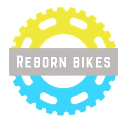

## Reborn Bikes

Our mission is to bring refurbished bicycles

and bike education to underserved populations

while lowering carbon emissions in our region.

We believe bicycles are a vital part of a

thriving and sustainable community.

## FB4K-Portland

FB4K Portland is part of a national network

which collects, fixes and gives away bikes

to those in need. With regular collection drives

and volunteers who come into warehouse

and get the bikes ready to roll.

## WTA

Established in 1997, Westside Transportation Alliance

is a 501(c)(6) nonprofit organization that works

with its corporate member organizations to offer

workplace services and programs that encourage

their employees to commute to work by transit,

carpool, vanpool, bicycling, teleworking and walking.

## Front Street Bikes

Front Street Bikes is a community bike shop,

volunteer-run and donation based. We are

an inclusive and welcoming DIY workshop

where you can bring in your own bike and

work on it with our help, tools and supplies.

We accept donations and restore bikes for

resale on a sliding scale for all our community

members who ride for health, recreation

or bicycle commute. transportation. We

believe our community will be healthier

and happier if more bicycle riders are

on the road.

## P:ear Bike Works

A bike shop for everyone.

Bike Works is a program of p:ear, formed a

dozen years ago to give homeless youth a

chance to learn skills and gain independence

and gain employment, it operates a retail

and repair shop in East Portland and distributes

refurbished bikes.

## ReDeploy

In a world where community welfare

and environmental sustainability

are paramount, ReDeploy stands

out as a shining example of

innovations and compassion.
