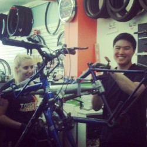

## Want to join our team?

We have a limited number of strategic positions available as paid staff positions, on a seasonal or ongoing basis.

**Help get bikes-and freedom-into more hands.**

WashCo bikes provides thousands of bikes each year to people in need, and we rely on volunteers to make it happen. Whether you can help weekly or just once in a while, we’d love to have you, especially as biking season ramps up.

**Media Specialist**

Help expand our reach through social media and digital platforms. We are looking for volunteers interested in managing or designing content for Facebook, Instagram, Tik Tok, Threads, and more. We are also interested in exploring if AI could help redesign and update our website. If this sounds like you contact us as [media@washcobikes.org](mailto:media@washcobikes.org)

**Summer Camp Support**

Our summer bike camps serve kids ages 8-12, teaching bike safety while exploring local parks and attractions. We’re seeking:

1. A volunteer to help us with administrative tasks such as data entry, making badges, putting together camp day tubs, and helping with registration.
2. Individuals with knowledge of bike safety who enjoy working with kids, to serve as camp counselors.

 If either of opportunities are up your alley, let us know.

 Contact Nancy at [info@washcobikes.org](mailto:info@washcobikes.org).

**Shop Greeter**

Do you enjoy helping people and talking about bikes? We are looking for individuals who could help with customer support efforts at our community bike center, taking the load off our mechanics so they can concentrate on bike repairs. If this sounds like you contact [tkelley@gmail.com](mailto:tkelley@gmail.com)

**Bike Advocacy**

Do you have an interest in supporting efforts to improve bicycle infrastructure and safety by reviewing public documents and providing feedback to local partners? Contact [John@washcobikes.org](mailto:John@washcobikes.org)

**Bike Cleaning and Repair**

It takes an army to clean and repair the thousands of donated bikes we give out each year. Individuals with bike mechanical skills are welcome, but we especially need help with basic cleaning tasks, making sure all our donated bikes look and run as great as possible.

Contact [tkelley@gmail.com](mailto:tkelley@gmail.com)

**Your help makes a difference. Join us and help keep our community rolling.**

## Want to volunteer?

**A team of volunteers from Intel**

Did you know that our volunteers collectively donate over **500 hours** each month?

WashCo Bikes is staffed almost entirely by volunteer labor.  Our volunteers include bike mechanics, event managers, educators, and more.   We couldn't do our work without our volunteers.  We welcome groups, so think about us when you are planning your next service project for your coworkers, scout troop, or church group. Whether you can spare one hour a week or 20 hours a month, we would love to have you in our community!

**[Volunteer Application](https://washcobikes.wufoo.com/forms/mj4go0f08z1znp/)**

**[For Board Openings](https://washcobikes.wufoo.com/forms/ry0m8911wccoqf/)**

We can't wait to hear from you!

## Words from our Executive Director

WashCo Bikes is a great organization that does a lot for the community. We can't do it alone. Volunteers are needed to help us move bikes along. Let us know if you'd like to join forces with us. Fill out the application and my staff or I will be in touch.

If you want to have a volunteer day with your fellow company employees, we can also arrange for that.

## Get involved and help us achieve our mission!

|  |  |
| --- | --- |
|  | Your membership to WashCo Bikes gets you a 10% discount at the Community Bicycle Center, use of shop space to work on your bike, and a e-newsletter subscription. Your membership dues support all programs at WashCo Bikes. |

***[Donate Bikes and Part](https://www.google.com/maps/place/137+NE+3rd+Ave,+Hillsboro,+OR+97123/@45.5232512,-122.9886373,17z/data=!3m1!4b1!4m5!3m4!1s0x54951abb483ad8a1:0x26e6077a149eaada!8m2!3d45.5232475!4d-122.9864486)***

***Bikes and parts can be dropped off at the***

***Community Bike Shop***

***137 NE 3rd Ave.***

***Hours are:***

***Monday through Saturday 10-5pm***

***Sunday noon - 4pm***
