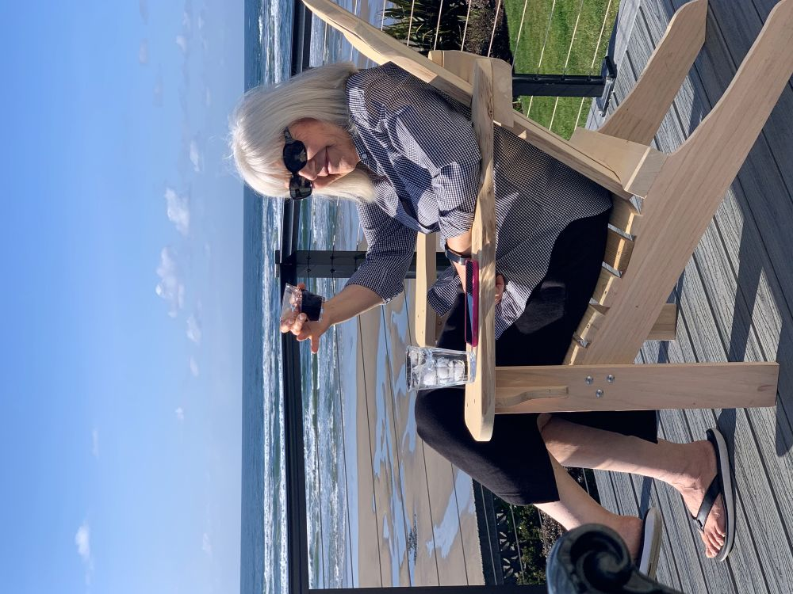
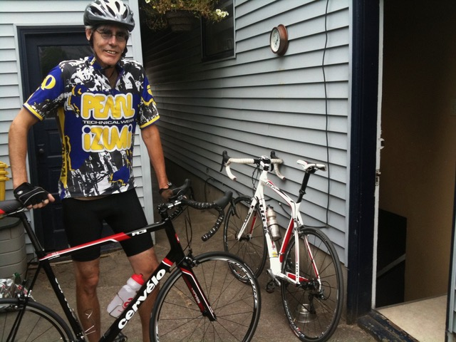
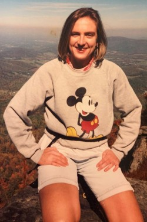

## Join us as a Member!

***Your donation -- of funds or bicycles -- helps us reach our goals!***

Pick the membership level that suits you then click on JOIN to sign up.

* Spokesperson              $45.00
* Family Wheel               $75.00
* Crank Arm                    $150.00
* Chain Ring                   $250.00
* Diamond Frame           $500.00
* Corporate Level           $1000.00

|  |  |
| --- | --- |
|  | Your membership to WashCo Bikes gets you a 10% discount at the Community Bicycle Center, use of shop space to work on your bike, and a e-newsletter subscription. Your membership dues support all programs at WashCo Bikes. |

Note on Employer Matching: If you are donating through Benevity or another employer matching program, search for us as Washington County Bicycle Transportation Coalition.

***Thank you!***

## Donate a bike!

If you have a bike you would like to donate, we invite you to do so!  Your donation will help us continue our efforts towards improving cycling in Washington County.

We carefully evaluate each donated bike. Durable bikes in good condition are cleaned and tuned up. Some go to eligible youth and adults in our community programs. Kid's bikes are in particular demand because they may be used in the fleet that we maintain for our youth education programs. Kid's bikes also are given needy children as a part of our annual "Adopt-A-Bike" program. Bikes not needed for our core programs are refurbished and sold in our retail shop with the proceeds benefitting our non-profit mission. Bikes in poor condition are carefully dismantled and usable parts are salvaged. Unusable bikes and parts are carefully recycled.

We have given away 100's of bikes to date and recycled tons of metal and rubber thanks to your contributions! Thank you!

**How to donate?**

You can bring a bike to our retail shop during posted business hours ([check here](/shop) for current shop hours). Or check our Facebook page for public bike donation events.

<h2 id="in-memoriam">In Memoriam</h2>

## Rita Jaeger August 17, 1948 - May 6, 2025

Rita loved riding her bicycle as a child in Germany before coming to America, and always loved that Oregonians ride bikes!

## In Memoriam

We honor our supporters, board members, and volunteers who have passed.  You can make a donation in their name or on behalf of your loved one [HERE](https://washcobikes.wufoo.com/forms/wtpjkw70br4sms/).

## Scott Kuzma 1958-2022

When I met my husband Scott Kuzma (1958-2022) and we started dating back in the '90s he was avid about road biking, doing “centuries” on the weekends.  For our first Christmas together he bought me a racing green Bianchi and the next summer we would set the VCR (!) so we could come home and watch the 20 minutes of Tour de France coverage that was offered back then.  We had a great time in 2000 following the Tour in France, a bucket list trip.  In other words, he made me a fan of the bike!

We took many lovely rides together over the years - he was my mechanic, fixing my flats, cleaning my chain... and my coach — urging me to go another mile, climb another hill.  He will be missed!

~ Sarah Hefte

## In Memory of Brad Stark

**1966-2023**

As many who live in the Gleneden and Fogerty Creek Beaches area of the Oregon coast know, Brad was fatally injured in a motor vehicle accident on July 7, 2023 while cycling near Depoe Bay, Oregon.

Brad was a software engineer and an avid cyclist who enjoyed cycling in the Hillsboro/North Plains and Oregon Coast areas.

Brad’s family has received an outpouring of support from the community and friends, and it has been very comforting and greatly appreciated. Many have asked if there was a charitable organization they might donate to in Brad’s memory.  
After much consideration, the family has chosen Washington County Bikes (WashCoBikes.org) near his home in Hillsboro, OR as the charity they see best fitting to honor Brad’s memory.

The family wishes to thank everyone who chooses to donate to this worthy organization, and we are forever grateful for your kindness.

## Carl Nelson

.jpg)

Carl Nelson (1952-2019) - One of the original founders and a longtime member of the Board of Directors of WashCo Bikes, Carl tirelessly promoted our mission of improving cycling locally and serving our local community, especially children. Carl has made WashCo Bikes a family legacy: he is survived by his daughter Shannon, currently serving on the Board of Directors, his granddaughter Allie, founding member of our youth advisory committee, and his wife, longtime and devoted volunteer Nancy.

## Dr. Jennifer Kurmaskie-Konopka

Dr. Jennifer Kurmaskie-Konopka (1963-2019) The beloved sister of our Executive Director Joe Kurmaskie, Jennifer was an avid outdoorsperson and pediatrician whose memory will be honored by a donation that introduces children to the freedom of cycling.

## Mark Norberg

.JPG)

Mark Norberg (1953-2017) was one of the founding members of Washington County Bicycle Transportation Coalition and volunteered many hours in the shop as well as serving on the board for many years. For Mark, bicycling was a low environmental impact form of transportation. He always liked to say he "drove" his bicycle and "rode" in a car. In the summer of 1985, Mark's most notable bicycle trip was to drive solo cross-country starting in Portland, OR and ending in Boston, MA. His judgment influenced the growth and mission of WashCo Bikes in countless ways.
