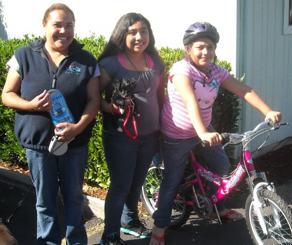
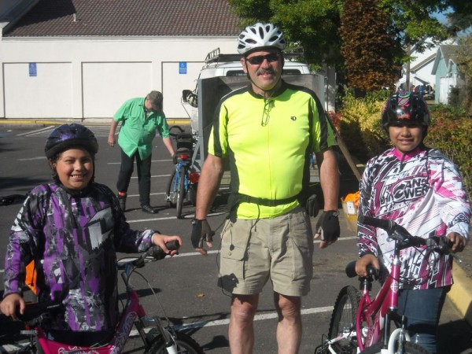
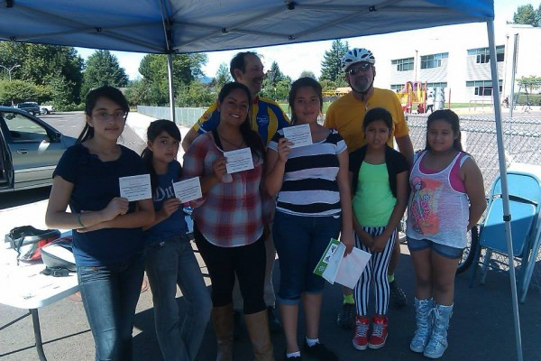
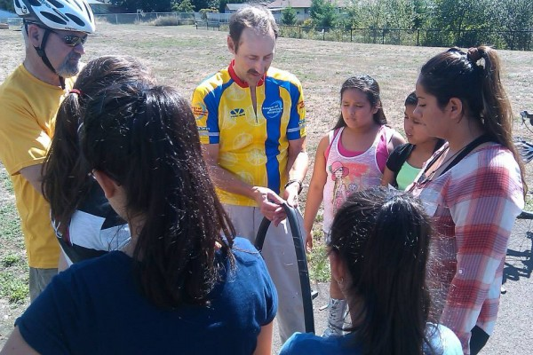
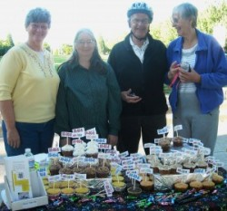
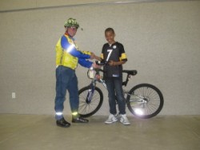

## Fred Meyer Community Rewards

You know you can support WashCo Bikes when you donate or volunteer, but did you know about these other great ways to support us? Also, see if your employer does donation matching. Please note that some systems, including Intel's Benevity, use our former name **Washington County Bicycle Transportation Coalition**.

|  |
| --- |
| Sign up for the Fred Meyer Community Rewards by linking your Fred Meyers Rewards card to  [www.fredmeyer.com/communityrewards](http://www.fredmeyer.com/communityrewards). Note: search for the name **Washington County Bicycle Transportation Coalition** . Then, every time you shop and use your Rewards Card, you are helping WashCo BTC earn a donation. You still earn points on Rewards Points, Fuel Points and Rebates If you do not have a Rewards Card, they are available at the Customer Service Desk  at any Fred Meyer store. |

<h2 id="our-stories">Our Stories</h2>

## Adopt-A-Bike

We are very proud of our Adopt-A-Bike donors and sponsors.

The generosity of many private donors, a generous gift of new bikes from the KPTV Fox 12 holiday toy drive, and a several bikes refurbished and donated by Poynter Middle School students made it possible to brighten over 30 children's holidays with the freedom of a new set of wheels. Our partner school, WL Henry Elementary, and Adelante Mujeres have helped us identify the eager and responsible children who will benefit from their newfound independence.  In the words of *The Oregonian*,  "It was a true team effort that brought joy to twenty-one students at W.L. Henry Elementary School on Thursday, December 19, when they received their very own bike through the Washington County Bicycle Transportation Coalition’s (WashCo BTC) Adopt-A-Bike program."  [Read more of our OregonLive coverage here.](http://blog.oregonlive.com/my-hillsboro/2013/12/twenty-one_wl_henry_students_r.html)

## Dulce and Estella

Two young girls from Cornelius, Dulce and Estella Castilla, were disappointed they couldn’t participate in a community ride because they didn’t have bicycles to ride.  Maria Davila of Metro’s Vámonos Project, a community outreach effort to create awareness of the benefits of walking and biking for transportation and health, tried to find an affordable option so that the girls could participate in the event.  
   
Maria reached out to the Washington County Bicycle Transportation Coalition (“WashCo BTC”), a non-profit bike shop and a partner in the Vámonos Project, in hopes of renting bicycles for the girls.  Although WashCo BTC doesn’t have a rental program, Maria discovered loaner bikes could be arranged.  Tim Mitchelldyer, shop manager, asked that the girls come in before the ride to be fitted for the proper size.  When Estella hopped on her bicycle, he couldn’t get over her big smile.  Tim said, “She smiled and just kept smiling.  I’ve never seen a child smile so big!”  
   
Tim reported Estella’s infectious smile to others within the organization and suggested that the WashCo BTC give bicycles to the two girls.  
   
“It was not a hard decision to make,” commented board member and ride leader Carl Nelson.  “This is what The WashCo BTC enjoys doing – getting people, especially kids, on bicycles.”  In the case of Dulce and Estella Castilla, the two girls received a bicycle and locks for their bikes, an early holiday gift that will last for many years to come.  
   
For three years, WashCo BTC has sponsored an Adopt-A-Bike program for the holidays to give bicycles to those who may not otherwise get one.  Children and some adults receive a bicycle package consisting of a refurbished bicycle, a new helmet, a lock, and a two-hour skills course.  In 2011, 54 bicycle packages were adopted.  The WashCo BTC is hoping to have another successful year.  [Click here](/community_home/support_us) to get connected to the  Adopt-A-Bike program.

[Read what the Oregonian has to say about Dulce and Estella's new bikes.](http://www.oregonlive.com/forest-grove/index.ssf/2012/10/washco_btc_gifts_cornelius_gir.html)

## Chicas get their ride ready

LCI certified instructors worked with these young women from [Adelante Mujeres](http://www.adelantemujeres.org/) "Chicas" program on basic bike safety and skills.  What's more, these girls have agreed to attend Saturday classes at Fern Hill Elementary school in Forest Grove where we will have two more classes for the Chica's. This time these girls will be helping the instructors teach. Can you think of a better way to start a leadership program?

## Hugh's Story

**Hugh celebrating his 80th birthday after riding 80 miles in under 8 hours.**

We first met Hugh at the 4th Annual Tour de Parks, where he was riding the 60 mile “Le Grande Tour” in 90 degree heat. Hugh was actually in training for a milestone birthday event: he had set a goal to ride 80 miles in 8 hours, on his 80th birthday.

To, uh, “gear up” for this event Hugh was riding daily and tracking his progress on his blog (<http://80-80-8.blogspot.com/>). Finally, Hugh’s birthday dawned clear and cool — a blessing after several days of rain. Although he faced some wind the day of his big ride, Hugh made his goal — with 8 minutes to spare!

WashCo BTC was there to document the ride, and together with [Elders In Action](http://www.eldersinaction.org/about/ "Elders In Action"), help him celebrate with an honorary membership to WashCo BTC and over 80 cupcakes.  [Click here](http://www.oregonlive.com/hillsboro/index.ssf/2011/09/hillsboro_resident_hugh_fergus.html) to read Hugh’s story in The Oregonian.

## Jose's Story

 and helmeted friends with Nancy Nelson, WashCo BTC volunteer.")

**Jose (in green) and helmeted friends with Nancy Nelson, WashCo BTC volunteer.**

In September, Patterson Elementary ESL teacher Michelle Myers,  partnered with the WashCo BTC on a bicycle safety project to provide new bike helmets to students. One of the students, 9-year-old Jose (in the green Tshirt), mentioned that he needed a new helmet so he could ride his sister’s pink Barbie bike. Ms. Myers and the WashCo BTC presented Jose with an opportunity to earn a refurbished bicycle by improving his work habits and completing homework.

Since the beginning of October 1st, Jose has completed 95% or better of his assignments each week. On October 29, Jose received his new bike at school. Pictured is Jose with his mother and sister, Patterson principal Jonathan Pahukula, his teacher Michelle Myers, and Nancy Nelson the representative from WashCoBTC who presented him with a certificate of achievement.

1st Update:: We continue receiving updates on Jose. He has entered and won an art contest. He participates in giving announcements over the school intercom. His grades continue to improve as does his health. Jose is asthmatic. Since receiving and riding his bicycle daily, Jose only has to use an inhaler occasionally.

2nd Update: Jose’s teacher, Michelle Myers, continues to stay in touch with us. As the school year is winding down, she writes: “Hello! Thanks so much for keeping in touch with Jose and me this year. He gets a BIG smile on his face whenever I mention that you have asked about his progress.  
 I am happy to report that Jose has continued with his academic success. He attended a 14 week (Tu, Thurs) math tutorial which improved his state test score by 8 pts over last year. He also stayed after school for 6 weeks (Weds) to stay on top of his homework. His teachers have marveled at the change in this boy! He rides his bike EVERY DAY, rain or shine… ”

[Click here](http://www.oregonlive.com/hillsboro/index.ssf/2010/11/hillsboro_boy_get_upgrade_from_girly_bike_for_doing_his_homework_thanks_to_washington_county_bicycle.html) to read Jose’s story in The Oregonian.

## Tyler's Story

**Tyler gets his bike**

Tyler is a 12 year old, sixth grader attending Lincoln Street elementary school in Hillsboro. Tyler’s family has been hit hard by the economic downturn and just recently relocated. When moving, they were not able to take any bicycles. WashCo BTC was introduced to Tyler through the Hillsboro B.L.A.S.T (Bringing Leadership Arts & Sports Together) program. Tyler was extremely quiet during the classes but performed well.

As the classes progressed so did Tyler. We saw him emerge from this quiet timid boy to smiles and showing leadership skills to his fellow students.

We heard of the family history and asked if we could help Tyler acquire a bicycle. Tyler was asked to be a student leader in the following B.L.A.S.T. class, and he did this. On May 11, 2011, at the Lincoln Street Spirit Assembly, the WashCo BTC presented Tyler with a bike, a lock, and other accessories.

## More local press for WashCo BTC...

**Nonprofit bicycle shop WashCo BTC gifts Cornelius girls bikes** (The Oregonian, October 30, 2012)

"For Dulce and Estrella Castillo of Cornelius, this year's holiday season came early. The girls, ages 10 and 7, wanted to participate in a community bike ride Sept. 22 organized by Metro's ¡Vámonos! program, which encourages healthy living among Washington County Latinos. But with two broken bikes and no money to fix them, the girls were in a bind." [Read more](http://www.oregonlive.com/forest-grove/index.ssf/2012/10/washco_btc_gifts_cornelius_gir.html)

**Downtown Hillsboro will soon have three bike shops** (The Oregonian, February 28, 2012)

“Downtown Hillsboro soon will have three bike retail and repair stores. Two shops — the new Hillsboro Bike Co. and the previously Aloha-based Washington County Bicycle Transportation Coalition — will join 18-year downtown veteran Bike n Hike this month.” [Read more](http://www.oregonlive.com/hillsboro/index.ssf/2012/02/downtown_hillsboro_will_soon_h.html)

**Washington County Bicycle Transportation Coalition raising money to give bikes, accessories to Hillsboro students** (The Oregonian, November 9, 2011)

“The Washington County Bicycle Transportation Coalition is trying to raise $2,500 for its annual ‘Adopt a Bike.’ The non-profit’s goal is to give 50 bicycles and accessories to students at Reedville, Kinnaman and Lincoln Street elementary schools for Christmas. For $50, donors can sponsor one child.” [Read more](http://www.oregonlive.com/hillsboro/index.ssf/2011/11/washington_county_bicycle_tran.html)

**Hillsboro resident Hugh Ferguson completes 80-mile bike ride on 80th birthday** (The Oregonian, September 28, 2011)  
 “Six months ago, Hugh Ferguson set a goal for himself. He worried it was a silly goal, but he began training to bike 80 miles in eight hours on his 80th birthday.” [Read more](http://www.oregonlive.com/hillsboro/index.ssf/2011/09/hillsboro_resident_hugh_fergus.html)

**WashCo BTC – Supporting Kids & Communities** (BicyclePaper.com, July 2011)  
 “For years, nine-year-old Jose Vargas watched friends speed by on their fast and fancy wheels while he lagged behind on his older sister’s hand-me-down ‘girly bike…’” [Read more](http://www.bicyclepaper.com/articles/322-WashCo-BTC-Supporting-Kids-Communities- "BicyclePaper.com")

**Catching up with the Washington County Bicycle Transportation Coalition** (Bike Portland, March 27, 2011)  
 “With the tragic death of Bret Lewis last month, many people in the Portland metro area have become more aware of the challenging road conditions faced by people who choose to bike in Washington County… ” [Read more](http://bikeportland.org/2011/03/09/catching-up-with-the-washington-county-bicycle-transportation-coalition-49311)

**Jose’s Story** (The Oregonian, November 26, 2010)  
 “The first time Jose Vargas rode his new bike, he didn’t stop smiling. The 9-year-old wore a turquoise shirt and white shell-toe sneakers. He rode around the Paul L. Patterson Elementary School parking lot. He rode down the sidewalk. Then Jose looked up at his teacher and asked, ‘Can I just go home and ride my bike now?’” [Read more](http://www.oregonlive.com/hillsboro/index.ssf/2010/11/hillsboro_boy_get_upgrade_from_girly_bike_for_doing_his_homework_thanks_to_washington_county_bicycle.html)
