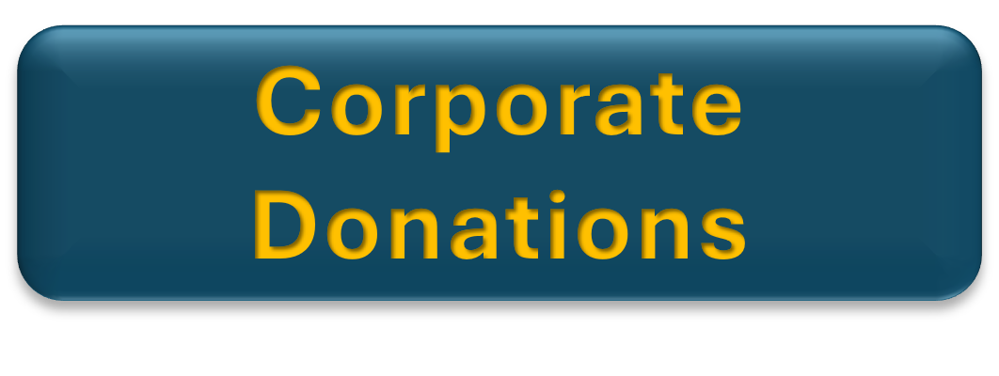
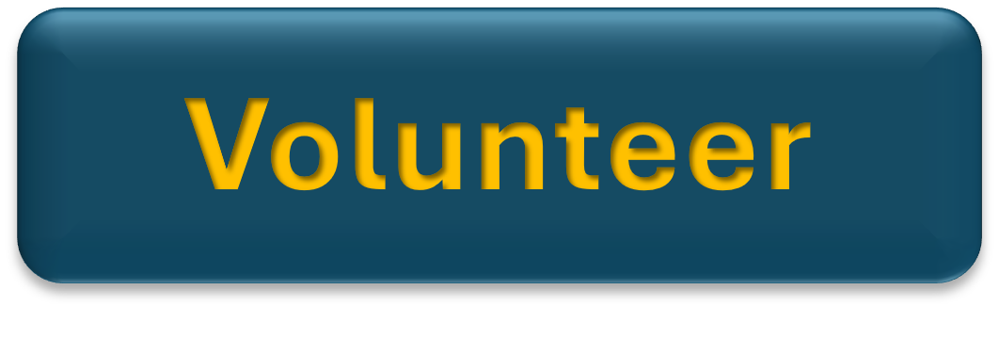

## Adopt-a-Bike Stories

### ***Sarah's Story***

"As a single mother, I struggled with transportation. Thanks to Adopt a Bike, I now have a bike to take my kids to school, go to work, and run errands. It's given me so much freedom and peace of mind!"

### ***John's Story***

"I served in the military and struggled to get around after I returned. Receiving a bike has helped me reconnect with my community, get to appointments, and even start a new job. I can't thank you enough!"

## Adopt-a-Bike 2025

## Supporting Our Community with WashCo Bikes

WashCo Bikes is committed to serving the diverse communities throughout Washington County. We provide access to bicycles, helmets, and essential safety equipment, ensuring that individuals not only receive the tools they need but also benefit from education and encouragement around cycling. Our organization partners with schools, social service agencies, community and faith organizations, as well as local police and fire departments. These partnerships help us connect with community members who need a bike for transportation, personal health, or general well-being.

## Adopt a Bike Program: Our Annual Fundraiser

Each year, we launch our “Adopt a Bike Program,” which stands as our largest fundraising effort. Community support through donations makes it possible for us to continue our mission. Your contribution can make a significant difference:

* $150 provides a child with a bicycle.
* $200 sponsors an adult bike package.
* Any amount is appreciated and helps us reach more people in need.

## Enlist your employer

Ask your employer to if they use a matching donor platform such as Benevity. If they do, please use that to make your donation and with the help of your employer, your donation has doubled.

Your employer may also choose to sponsor a specific number of bikes, helmets, or locks to support those  
who need them. Some employers will even sponsor a bike rodeo for the children of employees.

## Volunteer

Help refurbish bikes! Volunteer hours are crucial to the success of this program. Your time and skills can directly help prepare bikes for distribution.

## Spread the Word

Share the program with your friends, family, and social media networks. The more people who know, the more bikes we can donate and refurbish!

***Thank you for your support!***

## Special Thanks to Our Sponsors

|  |  |
| --- | --- |
|  |  |
|  |  |
|  |  |
|  |  |
