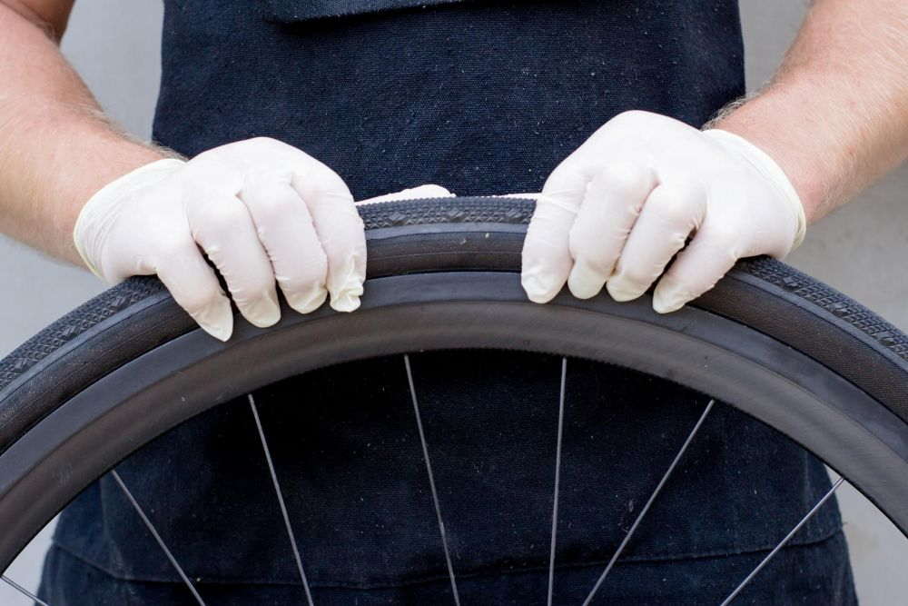
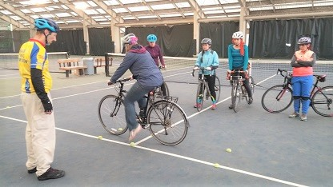
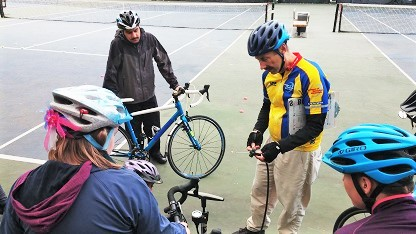
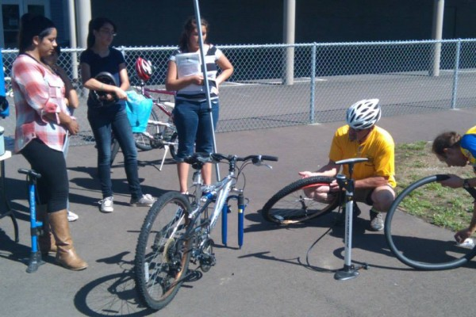
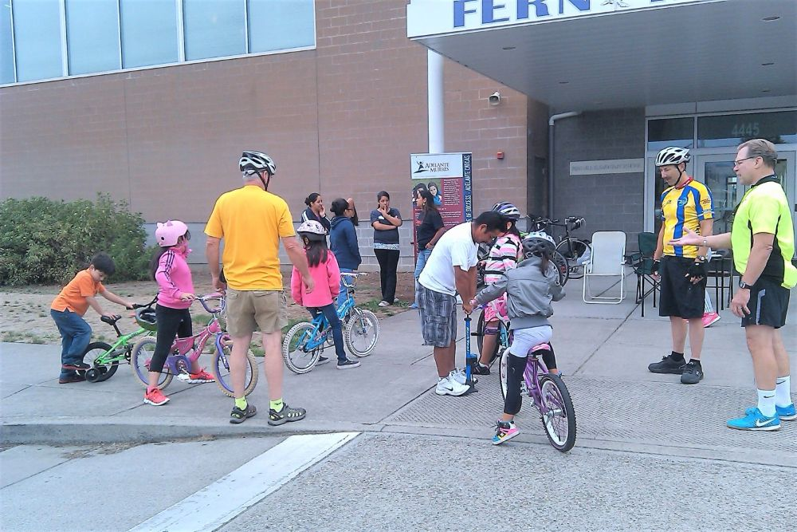

## Explore our education programs

* [Bike Repair Clinics](/programs/education#repair-clinics)
* [Smart Cycling/Safe Riding Workshop](/programs/education#smart-cycling)
* [Skills and Safety Rodeos](/programs/education#rodeos)
* [Adult Riding Confidence/Learn to Ride](/programs/education#learn-to-ride)

<h2 id="repair-clinics">Bike Repair Clinics</h2>

Want to learn how to adjust, clean, and repair your bicycle in a friendly, encouraging and instructive atmosphere? Bring your bike to one of our Bike Repair Clinics, and our qualified instructors will teach you how to maintain and fix it!

Learn how to:

* Fix flat tires
* Adjust seats & handlebars
* Adjust the derailleur
* Adjust brakes
* Clean the chain
* Repair and replace the chain
* Check for broken spokes
* Remove wheels for transport
* And much more!

All clinics are held at the

**Washington County****Community Bicycle Center**

137 NE 3rd Ave,

Hillsboro, OR 97214

Clinics are free, but there is a $20.00 registration deposit to hold your place.  After the clinic, this can be refunded to you or converted to a donation to WashCo Bikes -- your choice! Indicate which you want when you sign in at the clinic.

Grab a friend and have some fun!

Clinics are the third Tuesday of every month, 5:30-7:00 PM.  Specific dates are on the registration form.

[****](https://washcobikes.wufoo.com/forms/zj5khbd0nh9xar/)

<h2 id="smart-cycling">Smart Cycling</h2>

## Smart Cycling / Safe Riding Workshop

Ride with more confidence, more awareness, and a better plan for the road ahead.

The Smart Cycling / Safe Riding Workshop is for riders who already know how to ride and want to feel safer and more prepared riding on streets, paths, bike lanes, and through everyday traffic situations. This hands-on workshop helps riders move beyond simply staying upright and begin riding with purpose: seeing hazards earlier, communicating clearly, choosing good lane position, and understanding how to “drive” a bicycle predictably and confidently.

This workshop is a great next step for riders who want to commute by bike, ride more comfortably around town, join group rides, ride with family, or simply feel less uncertain when sharing the road with cars, pedestrians, and other cyclists.

Students will learn and practice practical Smart Cycling skills, including scanning, signaling, lane positioning, hazard avoidance, group riding awareness, basic bicycle safety checks, and the core habits of safer riding: Ride Ready, Be Predictable, Be Conspicuous, Think Ahead, and Follow the Law. Students will also receive a Smart Cycling manual to keep as a reference after the workshop.

This is not a Learn to Ride class. Riders should already be able to start, stop, steer, brake, shift, and ride comfortably before attending. If you are a new or returning rider who needs help with basic riding confidence first, please consider our Adult Riding Confidence Class.

**How the Workshop Works**

The workshop has two parts:

1. **Online instruction and testing**  
   Students complete the online learning portion at their convenience before the on-bike session. A score of 80% or higher is required to complete this portion. This helps riders arrive with a shared understanding of the basic concepts so the in-person time can focus on practice, coaching, and real-world application.
2. **Hands-on on-bike instruction**  
   The on-bike session typically lasts 3–4 hours, depending on class size, rider skill levels, and conditions. The session begins in a parking lot or similar controlled area where students practice bike handling, safety checks, scanning, signaling, hazard avoidance, lane positioning, and other core riding skills.

The workshop then moves to a supervised group ride on local streets, where students apply what they learned in real riding situations with instructor guidance and support. This is where the concepts become practical: reading the road, making safer choices, riding predictably, and building confidence one decision at a time.

Please bring a bicycle in safe working order, a properly fitting helmet, water, snacks, and clothing appropriate for the weather. Helmets are required.

At the end of the workshop, students will complete a short feedback form, and the instructor will complete a road test score sheet to document the skills practiced and demonstrated.

Registration closes 7 days before each workshop to allow time for students to complete the online instruction and testing. Class size is limited, so early registration is recommended. Once registration is completed, students will be directed to the payment page.

**Upcoming Dates:**

* Saturday August 29
* Saturday September 26
* Saturday November 28

**Course fee:** The full course value is $250. WashCo Bikes subsidizes this workshop so riders pay **$75**. Grants and scholarships may be available when cost is a barrier.

  

<h2 id="rodeos">Skills and Safety Rodeos</h2>

WashCo Bikes hosts and stages skills and safety bike rodeos for schools, churches, recreation centers and municipalities, specialty events and at festivals.

What is a Bike Rodeo? A chance for people of all ages to improve their safety and bicycle skills through fun education activities that include following games, foot down races, slow races, obstacle courses, turns and stops.

We organize our rodeos to fit all age groups, up to 50 people and can last from 60-120 minutes.

We provide instructors, equipment, programming light repair and bike safety checks, free helmets, lights and written educational material.

Pricing for a rodeo is $250.00. Once you have filled out the registration page, you will be taken to the payment page. You will then be contacted to arrange a

date and time for your event.

<h2 id="learn-to-ride">Learn to Ride</h2>

## Riding Confidence for all Ages

Whether you are learning for the first time, helping a child move beyond training wheels, or returning to bicycling after time away, WashCo Bikes can help you build confidence one step at a time.

WashCo Bikes’ riding confidence classes are friendly, supportive one-session lessons for youth and adults who are ready to learn, return, or feel more comfortable on a bicycle. Whether a rider is getting on a bike for the first time, moving beyond training wheels, or coming back after years away, the goal is the same: help each rider feel steadier, safer, and more confident.

These classes use a calm, balance-first approach. Riders practice the skills that matter most at the beginning: bike fit, helmet fit, balance, braking, starting, stopping, steering, and pedaling when ready. Instruction is paced to the rider, with encouragement and simple coaching at each step.

**Youth Learn to Ride**

Youth Learn to Ride is for children who are learning to ride for the first time, moving beyond training wheels, or needing extra help with balance and basic bike control.

Riders must be at least 6 years old. Sessions are usually one-on-one, although siblings or friends may be scheduled together when appropriate.

**Adult Riding Confidence**

Adult Riding Confidence is for adults who are learning to ride for the first time, returning after time away from bicycling, or looking for a refresher before riding more often.

This class meets riders where they are. Some riders may focus on balance, braking, and pedaling. Others may work on starting, stopping, scanning, signaling, turning, or feeling more comfortable riding in everyday situations.

**Session Format**

Each class is one session and may last up to one hour, based on rider needs and progress. Instruction is usually one-on-one so riders can learn at a comfortable pace.

Please bring a bicycle in safe working order, a properly fitting helmet, water, and flat closed-toe shoes. Helmets are required.

**Keep Building Confidence**

After completing a Riding Confidence session, riders who want to continue building skills can consider WashCo Bikes’ Safe Riding Workshop. Safe Riding combines online learning with hands-on on-bike instruction and helps riders build awareness, scanning, signaling, predictable riding, hazard avoidance, and confidence in real-world riding conditions.

**Cost and Scheduling**

The cost is **$75 per student**. Grants and scholarships may be available when cost is a barrier.

More than one student may be included when appropriate, such as siblings or friends learning together.

Register and pay using the button below. A WashCo Bikes cycling instructor will contact you to schedule the session.

**Upcoming Small Group Classes**

* Saturday August 22
* Saturday September 12
* Saturday November 14

