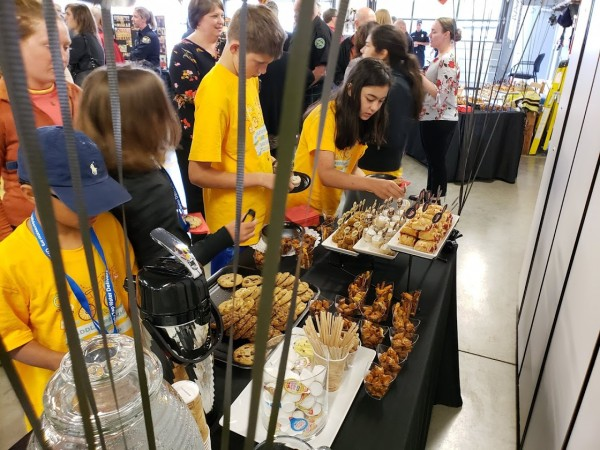
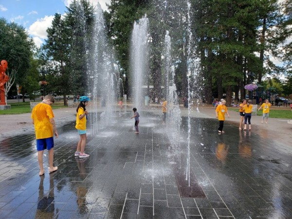
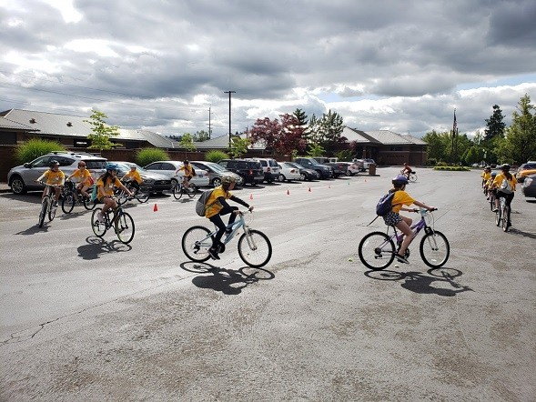
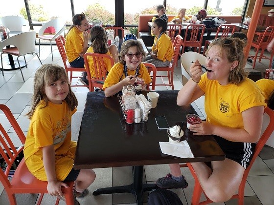
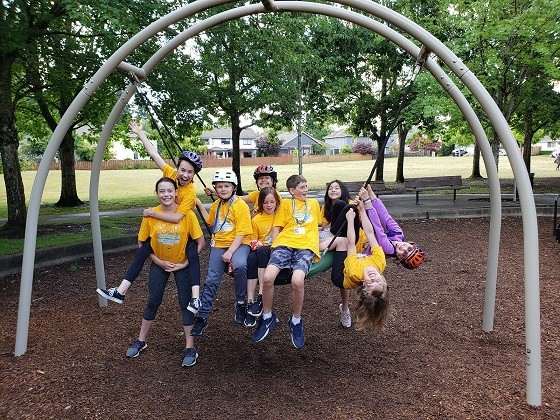
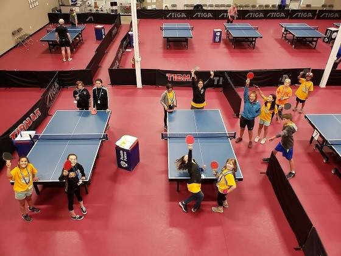
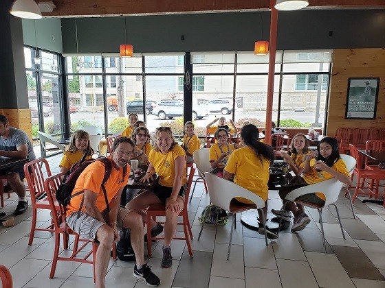
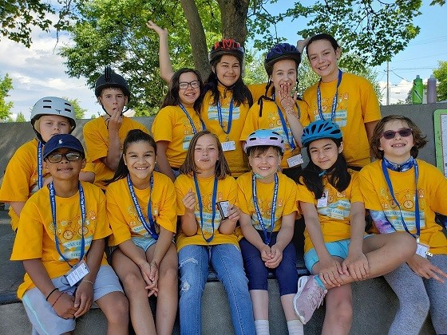
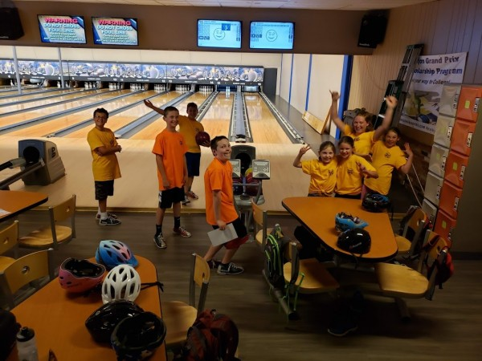
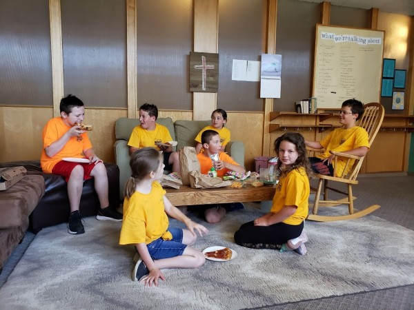

## Summer Bike Camps

## 2026 Camp registration opens March 1.

General information:

* Camps will be broken into groups based on age:
* + Wheelies, ages 8-10.
  + Cruisers, ages 11-12.
  + Counselors in training, ages 13+ with previous year experience.
* There is a limit of 15 kids per camp.
* Camp costs $350.
* Scholarships are available (please contact Emily at [camps@washcobikes.org](mailto:camps@washcobikes.org) to request a scholarship).
* Camp runs Monday - Friday, 9am - 3pm.
* Drop-off time is 8:30am- 9:00am, pick-up time is 3:00pm-3:30pm.

We’re also looking for paid and volunteer**instructors** to lead camp sessions! If you love biking and working with kids, this is a great opportunity to spend your summer outdoors, teaching bike safety and leading fun adventures. Apply here: [Bike Camp Instructor Employment Application](https://washcobikes.wufoo.com/forms/p45py9v0sl3rpr).

## 2026 Bike Camp Dates and Locations

**June 22-26**

Forest Grove (1940 Pacific Ave.)

**June 29-July 3**

Forest Grove (1940 Pacific Ave.)

**July 6-10**

Hillsboro (First Congregational Church/UCC)

[FULL - Closed for registration]

**July 13-17**

Hillsboro (First Congregational Church/UCC)

**July 20-24**

Tigard (Fanno Creek House)

**July 27-31**

NO CAMP

**August 3-7**

Hillsboro (First Congregational Church/UCC)

**August 10-14**

Hillsboro (Tyson Recreational Center)

[FULL - Closed for registration]

**August 17-21**

Hillsboro (First Congregational Church/UCC)

---

**Saddle Up Bike Camp Registration**

Here is all the paperwork you need to register your child for a summer bike camp.  Please e-mail Emily at [camps@washcobikes.org](mailto:camps@washcobikes.org) if you have any questions or special requests.

**Start Here:**

* [Bike Camp Registration](https://washcobikes.wufoo.com/forms/z1rqehgv0smnd3h/)  
  Use this form to register Saddle Up Bike camp.  You will need to fill out a separate form for each camper that you will register.  For each camper, you will need to provide basic information and upload a head shot photo of them for the camp ID badge. At the end of the form, you will be taken to the payment page for the full price ($350), unless you intend to apply for a scholarship.  
    
  To apply for a scholarship, indicate that option on the registration and e-mail Emily at [camps@washcobikes.org](mailto:camps@washcobikes.org) with your particular request.

---

**Due June 1:**

* [Final Payment](https://washcobikes.wufoo.com/forms/mvnu24x13ji8fq/)  
  Use this form to submit your final payment, if you registered with a deposit.  You will need to fill out a separate form for each camper that you enrolled with a deposit. This is due by June 1 regardless of which camp you have registered for.

---

**Due two weeks before camp:**

* [Waivers and Policies](https://docs.google.com/forms/d/e/1FAIpQLScOsPuafsme2oZNhKMpB-MMZccvGKO99c-jrhthgo0gkCCrkg/viewform?usp=sf_link)  
  Fill out this form to accept, via e-signature, the waivers and policies required for your child to attend camp.  You will need to fill out a separate form for each camper.
* [Emergency and Photo Information](https://washcobikes.wufoo.com/forms/qx705vd0emauqf/)  
  Fill out this form with your child's medical information and contact information for any other people authorized to pick up your child. You will need to fill out a separate form for each camper.

---

**Due one week before camp:**

* [Bike safety check form (PDF)](/site/1562Wash/5_Bike_Safety_Checklist.pdf)  
  Print this form out and have a qualified bike shop inspect your camper's bike. WashCo Bikes (137 NE 3rd Street, Hillsboro, OR 97124) will do a safety check for free, up to one week before camp begins. The policies of other bike shops may vary.  You will need a separate form for each camper.  
    
  For bikes purchased after March 1, 2026, you may submit a copy of the receipt instead of the bike safety check form.  
    
  This form is not required for bikes from WashCo Bikes.

<h2 id="faq">Camps FAQ</h2>

## How do I register?

**The enrollment process has several steps:**

* Read and understand the basic camp requirements:
  + Each child must have a working bike (no training wheels) and be able to start/stop and ride in a straight line.
  + **Bike must have gears. We have some if you need to borrow one for the week- please let us know ahead of time.**
  + Each child must have a properly fitted bike helmet.
  + No "open toe" shoes allowed.
  + WashCo Bikes will not provide food for the campers. Each camper must bring a sack lunch and snacks, and a water bottle.
  + If a camper requires medications, he/she must be able to self-administer the medication.
* Register on line and pay in full or a deposit with final payment due June 1st
* Fill out the forms online and include a head shot photo of your child registering.

We also need forms to have in our files. Please fill out one set of forms

per child you are registering.

Please note at the bottom of the form page is a place for you to upload

a headshot photo of your child. This is for their photo ID badge.

Bike camp forms

https://washcobikes.wufoo.com/forms/z1rqehgv0smnd3h/

**Refund Overview**:

60 days or more before the camp, full refund minus 15% fee

31-59 days, 50% refund

30 days or less, no refund allowed

## Q: What Camp Forms do I need?

**Registration**

* **The registration process is** a two-page process. Page 1 is for the general information. When finished- click the "SUBMIT" button at the bottom of the page. This will take you to our payment page.  Fill out all of the information and at the bottom of the page click the "SUBMIT" button. This will take you to a thank you page. You are finished with the registration.
* You will receive an e-mail shortly after registration and payment have been completed. This is to inform you what we have received.
* You can also pay by check in person or by mail: WashCo Bikes/Camp 137 NE 3rd Ave. Hillsboro, OR, 97124

**Forms**

* We have switched to using online forms.
* Please note at the bottom of the form page is a place for you to upload a headshot photo of your child. This is for their photo ID badge.

* [Liability and Media Waiver Form](site/1562Wash/5__Waiver__Media_Form.pdf)

## Q: What are the logistics of camp?

* There are 7 weeks of day camps available, limited to 15 campers per age group, 8-10 and 11-13.
* Day camps will be held from 9am-3pm, Monday through Friday. Drop off and pick-up times 30 minutes before/after camp.
* Day campers will need to bring a lunch, snack and water each day.
* In all camps, campers will spend some time each day at the "base camp", working on skills, maps/route planning, etc.
* Campers will spend much of the day on their bikes riding through neighborhoods to fun destinations and trails.

## Q: I want my child to attend camp but we are leaving on vacation, can I get a price break?

**A:**At this time we don't have a rate for a partial week.

## Q: Do I have to bring my child's bike to camp every day?

**A:**No, we have pre-arranged to store the bicycles, helmets, locks each night in the classroom. The classrooms are secured.

## Q: I don't get off work until after 3pm. What happens to my child?

**A:** All children need to be picked up between 3:00 and 3:30pm. Sometimes special arrangements can be made with the instructors but if you are going to be late, you'll need to arrange someone to pick up your child.

We have a form you'll be asked to fill out stating who is authorized to pick up your child. If you send someone to pick up your child and they are not on the list, **your child will NOT be released**. You need to notify the instructors of any changes and make notes on the forms.

## Q: Can parents ride with their children?

**A:** Parents and grandparents, you are invited to join us for a Family Ride on the last day of Summer Bike Camp.

We want you to see your child in action, showing off the skills he/she has learned during the week. The details of the ride are still in the planning stages but on Friday at noon or 1pm we will meet at the camp base with bikes, helmets, and water bottles. The kids will plan out the route – so be prepared for an adventure! Along the way, they may want to stop and explain why it is they do a certain something (ex. riding single file vs 4 or 5 abreast). Feel free to ask questions. Please allow 1 hour for the ride. When we return to the camp base, we will have a short graduation ceremony.

## Q: What do the kids do at camp?

**A:** A typical day begins at 9am when parents drop off the campers. Once checked in, kids and instructors meet in the classroom to plan out the day.

On Monday the instructors evaluate the kids riding skills, work on safe riding drills, and go for a ride to a park for lunch.

The rest of the week, the campers will go over drills, plan out what and where they are going and head out on an adventure.

The campers will spend the better part of each day riding and exploring. During the week, they'll get introduced to mass transit and how to board with their bike. Towards the end of the day, they'll head back to the classroom to meet parents for pickup.

On Friday, which includes a wrap-up after lunch, there will be a short test to find out what they learned during the week (this is for our purposes only). The kids all receive a goody bag and letter of completion.

## Q: Are there Bike Camp Scholarships?

The amount of scholarships we offer varies from year to year and depends upon sponsor generosity.

To be considered for a scholarship you need to be referred by an agency or contact [info@washcobikes.org](mailto:info@washcobtc.org).

Qualifications for a scholarship include, but are not limited to:

* Your child receives a free lunch at school.
* You have an Oregon Trail card (you may be asked to show it).

## Q: My Child doesn't feel well-should they attend camp?

**A:** This is a decision for you as a parent needs to make. Please understand the kids are doing a lot of riding each day. The first three days are spent working on skills and incorporating them into riding. Missing camp during these days makes it hard to keep up on the final two days they are riding. much of the day.

<h2 id="gallery">Photo Gallery</h2>

## Here are a few pictures from the past Camps

