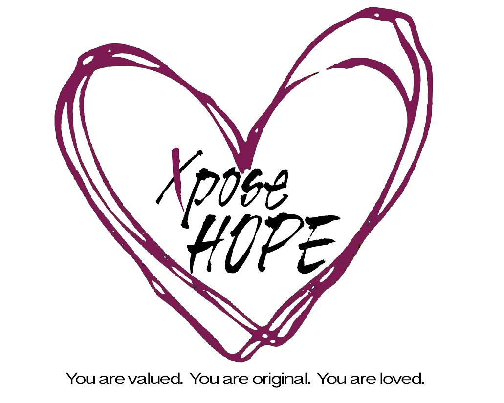
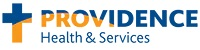
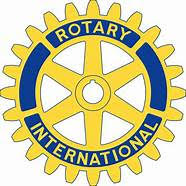
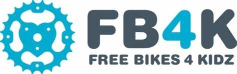

## Meet our sponsors

These wonderful local businesses and organizations help us build community, make our streets safer for cycling, and connect neighbors.

|  |  |  |
| --- | --- | --- |
|  |  |  |
|  |  |  |
|  |  |  |
| [**BikeLoud**](https://bikeloudpdx.org/) |  |  |
|  |  |  |
|  |  |  |

|  |  |
| --- | --- |
|  |  |
|  |  |
